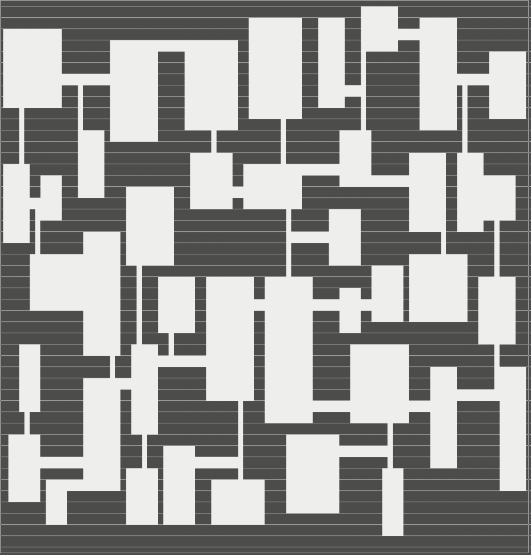
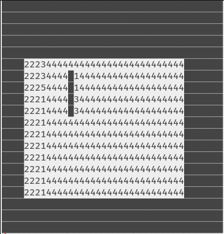

# RogueLibs

## Procedural Dungeon Generation

## DirectionFlooder
This little library creates a map with directions to follow to a source.
It's very useful to use as AI pathfinding towards the player.

